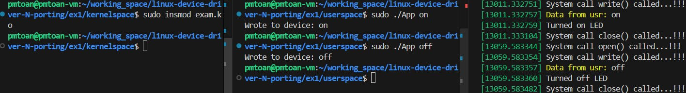

# Bài tập 1

Tạo một character device file và một ứng dụng ở userspace.

* Khi ứng dụng App (tầng userspace) ghi "on" vào device file, kernel sẽ in ra "Turn LED on".
* Khi App ghi "off", kernel sẽ in ra "Turn LED off".

---

# How to Build and Test

## Kernelspace

1. Build kernel module:

   ```sh
   cd linux-device-driver-N-porting/kernel-module-linux/02-KM-app-chdev-driver/kernelspace
   make
   ```
2. Insert and remove module:

   ```sh
   sudo insmod character-device-driver.ko       # Insert module into the kernel
   sudo rmmod character-device-driver           # Remove module from the kernel
   sudo dmesg -w             # View kernel logs
   ```

## Userspace

1. Build the user application:

   ```sh
   cd linux-device-driver-N-porting/kernel-module-linux/02-KM-app-chdev-driver/userspace
   make
   ```
2. Run the application:

   ```sh
   sudo chmod 0666 /dev/m_character_device  # Set read/write permission on the device file
   ./App on                                 # Send "on" command to device
   ./App off                                # Send "off" command to device
   ```

---

# Result

## Insert module and write



## Remove module


