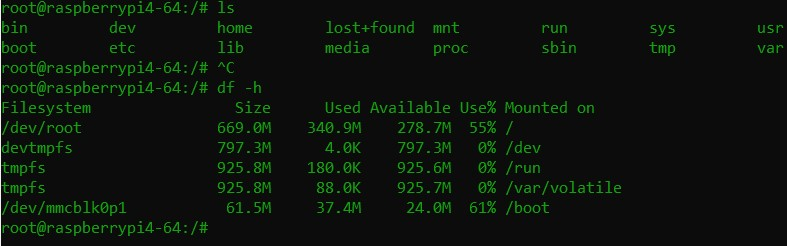

# Yocto Testing on QEMU and Raspberry Pi 4

This document summarizes the testing process of builds image Yocto (devtool, package dependencies, Yocto SDK, image Yocto rsp) on a QEMU virtual machine and Raspberry Pi 4.

---

## Test package dependencies on QEMU machine

---

## Test build SDK Yocto on QEMU machine

---

## Build successfully image yocto for raspberry pi 4 (64-bit)

---

## Flash and test successfully image yocto on raspberry pi 4 (64-bit)

